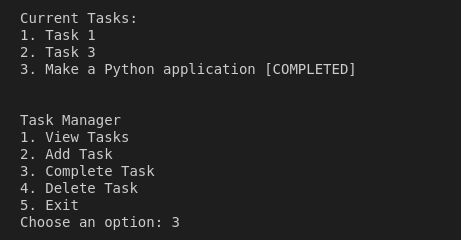

# Task Manager

Task Manager is a simple Python application that allows you to manage your tasks. You can add, delete, and mark tasks as completed.

## Getting Started

Follow these instructions to download, set up, and run the Task Manager application on your local machine.

### Prerequisites

- Ensure that `python3` and `pip` are installed on your system.

### Installation

1. **Clone the Repository**:
   ```bash
   git clone https://github.com/ImmutableSpirit/task_manager.git

2. Navigate to the Project Directory:
    ```bash
    cd task_manager

3. Create a Virtual Environment (if it’s not already there):
    ```bash
    python3 -m venv myenv

4. Activate the Virtual Environment:
    - For Linux/macOS: 
        ```bash
        cd task_manager
    - For Windows
        ```bash
        myenv\Scripts\activate

5. Install Required Dependencies:
    ```bash
    pip install -r requirements.txt

### Running the Application

Once the setup is complete, you can run the application using the following command:    
    
    python task_manager.py

Run the tests with:    
    
    python -m unittest test_task_manager.py


